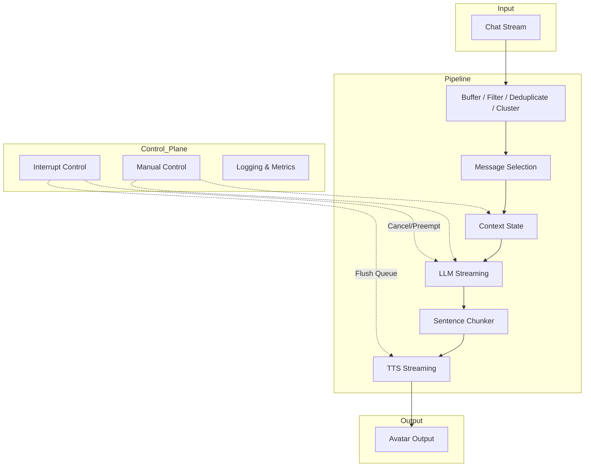
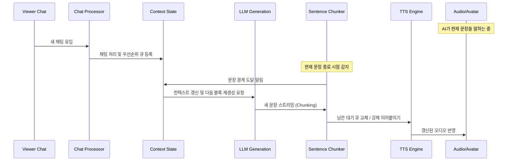
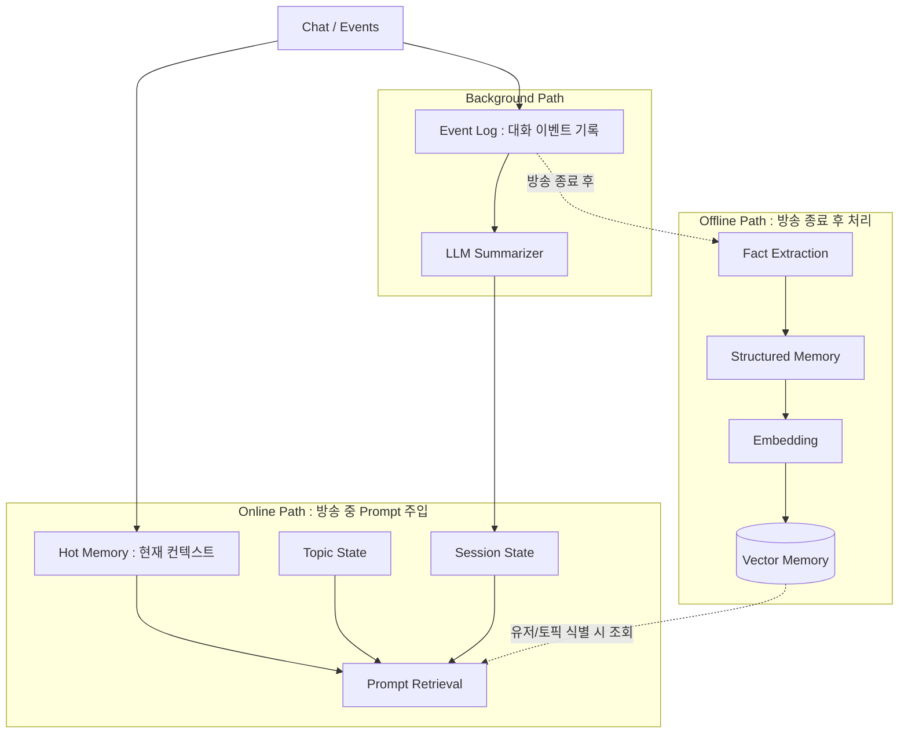
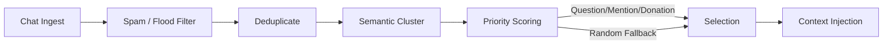
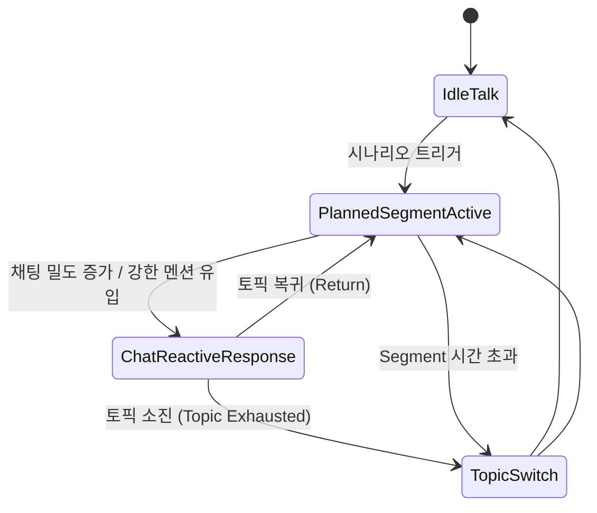

# EchoCaseAiri — 작업 메모

EchoCast × Airi 통합 프로젝트 메모장.

---

## 📁 구조

```
EchoCaseAiri/
├── airi/           # Project AIRI (upstream fork)
│   ├── packages/echo-memory/   # 커스텀 패키지: Tri-Core 메모리 + sLLM Bouncer
│   ├── packages/gemini-utils/  # 커스텀 패키지: @google/genai 공유 유틸
│   └── analysis/               # 아키텍처 분석 문서들
└── EchoCast/       # 기존 EchoCast (Python 원본)
```

---

## 🔍 분석 문서

| 파일 | 내용 |
|------|------|
| [`airi/analysis/airi_llm_triggers.md`](./airi/analysis/airi_llm_triggers.md) | LLM 인퍼런스 트리거 & 컨텍스트 주입 구조 |
| [`airi/analysis/echocast_migration_plan.md`](./airi/analysis/echocast_migration_plan.md) | EchoCast → Airi 이식 로드맵 (P0~P8) |
| [`airi/analysis/input_flow_overview.md`](./airi/analysis/input_flow_overview.md) | 채팅/오디오 입력 플로우 개요 |

---

## 📦 echo-memory 패키지

> **로컬 포크 전용** — `airi/packages/echo-memory`에 위치한 커스텀 추가 패키지입니다.

기존 [EchoCast](https://github.com/EchoVtuber/EchoCast) 프로젝트의 Tri-Core 메모리 시스템과 sLLM Bouncer를 Airi에 이식한 독립 패키지.
Airi 업스트림 업데이트에 영향받지 않도록 **Outside-In 전략**으로 설계됨.

### 아키텍처 개요

```text
채팅 입력 (치지직 / 데스크톱 UI / 웹 UI)
  ↓ (serverChannelStore 'input:text' 이벤트 발생)
[Fast-path Filter]  정규식 기반 즉시 drop (ㅋㅋ / 이모지 / 스팸)
  ↓ pass
[sLLM Bouncer]      onBeforeMessageComposed 훅에서 **동기 대기(await)**
  │                 - ignore 판정 시 `BOUNCER_IGNORE` 에러 발생 → 메인 LLM 입구컷 (UI에서 에러 숨김 처리)
  │                 - rag 판정 시 검색
  ↓ pass
[Hot Context Pool]  weight×TTL 기반 Top-K 노드 (Node ID 타겟 업데이트 지원) → LLM 프롬프트 주입
  ↓
[Airi LLM]         메인 LLM 추론 시작 (최근 채팅 내역 슬라이딩 윈도우 전송)
  ↓ 응답 완료 후
[Summarizer]        슬라이딩 윈도우 초과 시 sLLM 요약 → Hot Pool 갱신
[Progress 업데이트] AI 응답 → context_summary 노드 progress_summary 갱신
```

### 패키지 구조

```
packages/echo-memory/
├── src/
│   ├── types.ts                  ContextNode, EchoMemoryOptions 등 핵심 타입
│   ├── logger.ts                 LLM API 콜/응답 정밀 로거 (BOUNCER / CONTEXT / PROGRESS / MAIN)
│   ├── memory/
│   │   ├── hot-pool.ts           Hot Context Pool (weight×TTL, Top-K, updateNode)
│   │   └── summarizer.ts         슬라이딩 윈도우 + sLLM 요약
│   ├── bouncer/
│   │   ├── fast-path.ts          정규식 빠른 필터
│   │   └── bouncer.ts            llama.cpp HTTP Bouncer
│   └── adapter/
│       └── airi-adapter.ts       Airi 연결 레이어 (mountEchoMemory)
```

### 사용법 (stage-web 초기화 시)

```typescript
import { mountEchoMemory } from '@proj-airi/echo-memory'

mountEchoMemory(serverChannelStore, chatOrchestratorStore, chatContextStore, {
  bouncer: { baseUrl: 'http://localhost:8080' },
  hotPool: { topK: 3, defaultTtl: 1800 },
  summarizer: { windowSize: 20, chunkSize: 10 },
})
```

### 구현 현황

| 단계 | 상태 | 내용 |
|------|------|------|
| P0 | ✅ | 패키지 스캐폴딩 |
| P1 | ✅ | Hot Context Pool (Top-K, Lazy TTL, **Stateful History**, **Content Freeze**) |
| P2 | ✅ | Fast-path Filter (정규식 즉시 drop) |
| P3 | ✅ | sLLM Bouncer (llama.cpp HTTP + **Gemini native SDK**) |
| P4 | ✅ | Airi 연결 레이어 (mountEchoMemory) |
| P5 | ✅ | Summarizer + Progress 업데이트 (**Gemini native SDK 지원**) |
| P6 | ✅ | 자율 발화 컨텍스트 주입 (spark:notify idle 어댑터) |
| P7 | ⬜ | 치지직 어댑터 연결 |
| P8 | ⬜ | Cold DB RAG (pgvector) |

---

## 📦 gemini-utils 패키지

> **로컬 포크 전용** — `airi/packages/gemini-utils`에 위치한 커스텀 공유 패키지.

`@google/genai` SDK 공유 유틸리티.
`echo-memory`와 `stage-ui` 양쪽에서 공유하는 Gemini 전용 코드.

```
packages/gemini-utils/src/
├── client.ts   — GoogleGenAI 인스턴스 캐시(apiKey별), isGeminiUrl()
├── call.ts     — callGemini() 단건 completion (Bouncer/Summarizer용)
├── stream.ts   — streamGemini() 스트리밍 + 내부 로깅
└── tokens.ts   — countGeminiTokens() REST API 토큰 카운팅 (fallback용)
```

### 설계 원칙 & 경로 분기

- **인스턴스 캐싱**: `getGenAI(apiKey)` — 동일 apiKey로 재사용
- **로깅 내재화**: `streamGemini()`가 요청/응답/토큰을 `console.debug` + `onLog` 콜백으로 처리
- **xsai 비의존**: 범용 타입(role/content 객체)만 사용
- **URL 기반 감지 (`stage-ui/src/stores/llm.ts`)**: `isGeminiUrl(url)` — `generativelanguage.googleapis.com` 포함 여부. Gemini provider 감지 시 native SDK로 분기, 그 외 xsai 경로 유지.

---

## 🗄️ 채팅 DB 관리

### 관련 파일

| 파일 | 역할 |
|------|------|
| `packages/stage-ui/src/stores/chat/session-store.ts` | 세션 생성/로드/삭제/초기화 핵심 로직 |
| `packages/stage-ui/src/stores/chat/maintenance.ts` | UI용 래퍼 (`cleanupMessages`, `resetAllSessions`) |
| `packages/stage-ui/src/database/repos/chat-sessions.repo.ts` | IndexedDB CRUD (unstorage 기반) |
| `packages/stage-layouts/src/components/Widgets/ChatActionButtons.vue` | UI 버튼 (채팅 초기화, DB 초기화) |

### 초기화 방식 비교

| 방식 | 함수 | 범위 | 설명 |
|------|------|------|------|
| 🗑️ 현재 세션 초기화 | `cleanupMessages()` | 현재 세션만 | system 메시지만 남기고 메모리+DB 초기화 |
| 🗄️ DB 전체 초기화 | `resetAllSessions()` | 모든 세션 | IndexedDB에서 모든 채팅 데이터 삭제 후 새 세션 생성 |
| 🔧 개발 시작 시 자동 | `VITE_DEV_CLEAR_CHAT=1` | 모든 세션 | 앱 initialize 시점에 DB를 먼저 비움 (race condition 없음) |

### `VITE_DEV_CLEAR_CHAT` 동작 원리

```
앱 시작
  └─ session-store.initialize()
       ├─ [VITE_DEV_CLEAR_CHAT=1] chatSessionsRepo.getIndex() → 모든 session 삭제
       │   └─ chatSessionsRepo.saveIndex({ characters: {} })  ← 빈 index DB에 저장
       └─ ensureActiveSessionForCharacter() → 새 세션 생성
```

> **⚠️ 주의**: `dev-seed.ts`에서 IndexedDB를 직접 조작하면 `session-store` 로드와 race condition이 발생하므로, 반드시 `session-store.initialize()`에서 처리해야 합니다.

### `.env.local` 설정

```env
# 앱 시작 시 채팅 DB 전체 초기화 (개발용)
VITE_DEV_CLEAR_CHAT=1

# 기존 설정 강제 덮어쓰기
VITE_DEV_FORCE=1

# LLM 추론 시 전송할 이전 채팅 컨텍스트 최대 개수 (기본값: 40)
VITE_CHAT_HISTORY_LIMIT=40
```

---

## 🏗️ LLM 콜 스택 (현재)

```
streamFrom(model, chatProvider, messages)
  │
  ├─ [Gemini 경로] isGeminiProvider() → true
  │    └─ streamGeminiNative()        ← stage-ui/gemini-utils.ts (xsai 타입 래퍼)
  │         └─ streamGemini()         ← @proj-airi/gemini-utils (SDK 직접 호출)
  │              └─ GoogleGenAI.models.generateContentStream()
  │
  └─ [xsai 경로] isGeminiProvider() → false
       └─ streamText()               ← @xsai/stream-text
            └─ fetch(baseURL + "/chat/completions")
```

**Bouncer / Summarizer (echo-memory):**

```
callLLM(baseUrl, model, messages)
  ├─ [Gemini] isGeminiUrl() → callGemini()         ← @proj-airi/gemini-utils
  └─ [그 외]  fetch(baseUrl + "/v1/chat/completions")
```

## 🎙️ 오디오 인터럽트 시스템 (Audio Interrupt)

사용자가 캐릭터 발화 도중 채팅을 입력할 때 발생하는 오디오 중단(Interrupt) 동작을 두 가지 모드로 지원합니다. 이 설정은 `Settings -> System -> General`의 **Hard Interrupt** 토글을 통해 제어됩니다.

| 모드 | 동작 방식 | 로직 특성 |
|------|-----------|-----------|
| **Soft Interrupt**<br/>(기본값) | 현재 입 밖으로 내뱉고 있던 문장까지만 끝까지 말하고 자연스럽게 재생을 마칩니다. | `playbackManager`의 현재 재생 노드(`active`)는 유지하고 대기 큐(`waiting`)만 비웁니다 (`clearWaitingByIntent`). |
| **Hard Interrupt** | 즉시 오디오 출력을 강제 종료하고 끊습니다. | 기존처럼 `playbackManager.stopByIntent`를 호출하여 재생 중인 노드와 대기 큐를 모두 즉시 파기합니다. |

*참고: 어떤 인터럽트 방식을 사용하든, LLM 대화 기록(Context)에는 구조적으로 "재생이 시작된(onStart) 문장"까지만 기록되므로 AI의 기억 동기화가 정확히 유지됩니다.*

---

## 💡 알려진 사항 & TODO

### Tools Compatibility (Gemini)

현재 Gemini provider도 `attemptForToolsCompatibilityDiscovery`를 거쳐 tools compatibility를 확인한다.
Gemini는 function calling을 natively 지원하므로 이 단계는 불필요하지만, 현재는 그대로 유지.

### LLM 로거 (echo-memory에 포함됨)

`echo-memory/src/logger.ts` — BOUNCER/SUMMARIZER 역할별 REQUEST/RESPONSE 정밀 로그 시스템.
- **콘솔 최적화**: 브라우저 콘솔(`console.debug`) 출력 시 최대 100자로 텍스트를 자름(`...`) 처리하여 UI 프리징과 터미널 스팸 방지.
- **전체 로그 보존**: 데스크톱 파일(`llm.log`, `chat.log`, `memory.log`) 기록 시에는 원문 훼손 없이 전체 프롬프트와 전체 응답이 무제한으로 저장됨. 앱 실행 시점의 타임스탬프(`RUN_ID`)가 파일명에 붙어 세션별 파일이 분리됨.
- **메모리 전용 로거 (`memory.log`)**: Echo-Memory `HotContextPool` 내부의 `onUpdate` 훅과 비동기 통신하여, Hot/Run Context 갱신 내역을 실시간으로 추적함.
- **비동기 페어링 (ReqId)**: 수많은 LLM 스트림이 겹칠 때를 대비해 모든 요청마다 매번 고유 ID(예: `[#0001]`)를 채번하여, 요청(`REQUEST`)과 응답(`RESPONSE`) 쌍을 완벽하게 시각적으로 묶어줌.
- **프롬프트 해시 검열**: 최초로 로딩되는 시스템 프롬프트 전체와 그 해시값을 찍어준 뒤, 이후부터는 해시값과 `(Omitted)`만 출력해 콘솔 길이를 대폭 압축.

*Gemini 네이티브 스트리밍 로그(`gemini-utils/stream.ts`) 내부에도 `ReqId`가 동일하게 적용되어 로그 추적성이 강화됨.*

### ⚠️ 중요: 다중 윈도우(Multi-Window) 아키텍처 디버깅 가이드 (Airi 특이점)

Airi 데스크톱(Tamagotchi) 앱은 **메인 캐릭터 창(`windows:main`)**과 **채팅 팝업 창(`windows:chat`)**이 서로 완전히 분리된 렌더러(Renderer) 프로세스 공간을 가집니다. 이 구조를 인지하지 못하면 심각한 디버깅 혼란(Silent Failure)을 겪을 수 있습니다.

#### 핵심 구조
- **Main Window (`Stage.vue`)**: 3D 캐릭터 렌더링, TTS 오디오 재생(`speech-pipeline.ts`), 메인 UI 담당.
- **Chat Window (`InteractiveArea.vue`, `chat.ts`)**: 사용자 채팅 입력, LLM 호출 및 스트리밍 처리 담당.

#### 주의사항 (디버깅 함정)
1. **분리된 DevTools**: 메인 창(캐릭터 창)에서 `F12`를 눌러 DevTools를 열어도, 채팅 창에서 발생하는 에러(`[HARD CRASH]` 등)나 LLM 스트리밍 로그(`chat.ts`)는 메인 창 콘솔에 **안 보입니다**. 반대로 채팅 창 DevTools에는 TTS 재생 로그가 안 보입니다.
2. **IPC 동기화 (`context-bridge.ts`)**: 윈도우 간 상태 공유는 Pinia 스토어를 직접 레퍼런스하는 대신, `context-bridge.ts`를 통해 Electron IPC 메시지(`broadcastStreamEvent`)로 상태를 동기화합니다.
3. **증상 (Silent Drop)**: `chat.ts`에 버그가 발생하거나 임의로 Throw를 던져 LLM 호출이 취소되어도, 메인 창만 보고 있으면 "데이터가 아무 에러도 없이 조용히 무시되는(Swallowed)" 것처럼 보입니다. (예: Auto-Speak 동작 시)

**💡 디버깅 팁**: LLM 동작 불량이 의심되면 반드시 **채팅 창(입력창)의 DevTools**를 별도로 열어서 `[Chat Orchestrator]` 관련 에러가 있는지 확인하세요.

---

### ⚠️ 최근 발견된 이슈 및 디버깅 히스토리

#### 1. Auto-Speak (Timeout) 무음 (Race Condition) 이슈 [해결됨]
- **현상**: LLM 텍스트는 정상 생성되는데 TTS API 요청(`[TTS_REQ]`)이 아예 안 가는 무한 대기 현상 발생. (또는 이전 응답만 반복)
- **원인 (IPC Lock)**: `context-bridge.ts` 에서 `stream-end` 도착 시 자물쇠(`remoteStreamGuard`)를 너무 일찍 해제하여, 0.05초 뒤에 도착하는 가장 중요한 `assistant-end` (Intent `.end()` 트리거) 통신이 Drop 됨. 종료 신호를 못 받은 TTS 파이프라인이 멈춰버림.
- **조치**: 자물쇠 조기 해제 로직을 제거하여 통신이 안전하게 수신되도록 수정 완료.

#### 2. 채팅 메세지 및 Intent 중복 생성 (Double Called) 이슈 [해결됨]
- **현상**: 사용자 채팅 입력 혹은 Auto-Speak 발생 시, LLM `ingest()`가 2번씩 실행되며 메시지 UI가 2개씩 찍히는 현상.
- **원인 (Multi-Window 함정)**: 데스크톱 앱(Stage Tamagotchi)은 **메인 창**과 떠다니는 **채팅 창** 독립된 2개의 Window를 띄우는데, **`InteractiveArea.vue` (채팅 입력창 부품) 가 양쪽 Window에 모두 마운트**되어 있음.
- **자주 한 실수 (Pitfalls)**:
  1. **잘못된 분기 처리**: 단순히 메인 창만 우대하려고 `if (window.location.pathname === '/')` 조건을 걸었으나 실패함. **[깨달음]** Electron 환경에서는 모든 창의 `pathname`이 `.../index.html` 로 고정되어 나오므로 저 필터링은 둘 다 통과시켜 버림.
  2. **올바른 분기 처리**: Vue Router의 Hash 모드를 활용해 `if (window.location.hash.includes('/chat')) return` 로 채팅 창을 명시적으로 차단시켜 AutoSpeak의 중복 Ingest를 막음.
- **조치 완료 사항**:
  - Auto-Speak가 이중으로 `ingest()`를 호출하여 서로를 Cancel 시키는 무한 루프는 URL Hash 검사로 해결함 (음성 출력 성공).
  - 하지만 **사용자가 직접 입력하는 일반 채팅이나 특정 이벤트에서는 여전히 채팅 내역이 2개씩 뜨는 현상이 잔존함**. 
  - `session-store.ts` 의 배열 Push나 다른 IPC 브로드캐스트(`output:gen-ai:chat:complete` 등)가 여전히 두 번씩 메세지를 렌더링하고 있는지 추가 조사가 필요한 상태임.

#### 3. Bouncer 설정(Setting) 누락 [해결됨]
- **현상**: Bouncer 초기화를 전역(`main` / `App.vue`)에서 개별 채팅 컴포넌트 내부로 옮기면서, Bouncer 관련 세팅값들이 제대로 적용(setup)되지 않는 이슈.

#### 4. 컨텍스트 주입(Context Injection) 차단 버그 [해결됨]
- **현상**: Hot Context나 Run Context가 `echo-memory`의 Pool에는 정상적으로 담겼으나, 실제 LLM 프롬프트에 주입되지 않아 AI가 상황을 인지하지 못함.
- **원인**: 이전 테스트 과정에서 `stage-ui/src/stores/chat.ts` 내부의 컨텍스트 병합(System Prompt 조합) 로직에 `if (false && Object.keys(contextsSnapshot).length > 0)` 형태의 Bypass 구문이 남아있었음.
- **조치**: `false &&` 조건을 삭제하여, `chatContextStore`에 Ingest 된 메모리 텍스트들이 정상적으로 시스템 프롬프트와 유저 채팅 사이에 삽입되도록 파이프라인을 복구.

#### 5. Gemini 시스템 프롬프트 캐싱 타격 및 Prompt Injection 방어 [해결됨]
- **현상**: 동적 컨텍스트(Hot Context)를 시스템 프롬프트에 직접 Append 하거나 새로운 `[system]` 메시지를 배열에 밀어 넣었을 때, Gemini API Native Caching(`systemInstruction`)이 깨져서 매 코스트마다 비싼 캐시를 재생성하거나, `[system]` 블록이 여러 개 생성되어 보안 필터(Prompt Injection 방어)에 막히는 문제 발생. 더불어 구글 서버가 `systemInstruction`을 제대로 인식하지 못해 `total_token_count=0` 에러가 나는 스펙 상이 문제도 존재했음.
- **해결 패턴 (Decoupling & State Tracking)**:
  - **페이로드 독립:** 변하지 않는 순수 오리지널 페르소나는 `rawSystemPrompt`로 분리하여 Gemini SDK의 `systemInstruction` (API Caching 타겟)으로 전송. (최신 V1Beta 스펙에 맞춰 `config: { systemInstruction }` 객체 내부로 전달하여 `token=0` 이슈 해결)
  - **가변 컨텍스트 우회:** 자주 변하는 동적 Context 문자열은 여기서 빼내어 **가장 첫 번째 유저 메시지(`[user]`)의 맨 상단 텍스트 앞에 덧붙이도록(Prepend) 설계**.
  - **지능형 캐시 생명주기 관리 (TTL Auto-Renewal):** 단순한 해시맵이던 추적 구조를 `PromptCacheEntry` 객체로 격상시켜 상태(`active`, `failed`, `too_short`)와 만료시간(`expireTimeMs`)을 기억하게 함.
    - 한번 길이가 짧거나 에러가 나서 실패한 캐시 생성 턴은 멍청하게 리트라이하지 않고 무음 스킵함.
    - 캐시 수명(10분)이 1분 미만으로 남은 시점에 채팅이 오면, 백그라운드에서 구글 서버에 `caches.update`를 날려 수명을 자동으로 10분 더 연장함.
    - 만약 수명이 이미 초과된 지 오래거나 통신 거부가 났을 경우, 그 즉시 폐기선언을 하고 해당 턴의 바로 아랫줄 로직으로 폴백하여 **1초의 지연도 없이 즉시 새 캐시 10분짜리를 구워냄**.
  - **로깅 리미트 해제:** `llm.log`에 찍히는 응답 텍스트의 800자(`...`) 제한을 없애 풀 텍스트 조망 가능.
- **결과**: `logger.ts`의 해시 중복 스팸방지도 정상 작동하며, LLM 응답 지연 단축 및 토큰 절약 Caching 기능이 완벽 복구됨. 불필요한 콘솔 스팸도 압도적으로 줄어듦.

#### 6. Hot Context (app-hot-context) 파일 초기 로드 지연 현상 [해결됨]
- **현상**: 앱을 켠 후 `hot_context.md` 파일이 5초 이상 늦게 인식되어 프롬프트에 뒤늦게 합류함.
- **원인**: `hot-context.ts`의 폴링 인터벌이 5초 단위인데, 1회차 실행 시 `EchoMemory Pool`이 미처 다 마운트되기 직전에 호출되어 `Skip` 당하고 다음 5초를 멍하니 기다리던 Race Condition.
- **조치**: 폴링 함수 내부에서 `!pool` 일 경우 `return` 하지 않고 `setTimeout`으로 1000ms 뒤 자가 재시도(Retry) 하도록 방어 코드를 작성하여, 기동 후 1초 내에 즉시 컨텍스트를 낚아채도록 가속.

#### 7. Auto-Speak 쿨다운 지연 및 문맥 단절 이슈 [해결됨]
- **현상**: Auto-Speak 트리거로 전송된 빈 메시지 처리가 끝난 뒤에도 설정된 `chatCooldownMs` 만큼 큐가 대기 상태에 빠져, 직후에 들어온 유저의 실제 메시지 처리가 지연됨. 또한 Auto-Speak 발화 내용이 문맥과 겉돌거나 부자연스러운 주제 전환을 시도하는 현상.
- **조치**:
  - `chat.ts`의 `sendQueue` 로직을 수정하여, 직전에 처리된 메시지가 빈 Auto-Speak 메시지일 경우 쿨다운 타이머(`setTimeout`)를 무시하고 즉시 다음 메시지 처리를 시작하도록 큐 흐름 최적화.
  - Auto-Speak용 시스템 프롬프트(System Note)를 기존의 "다른 화제로 넘어가라"에서 **"이전 대화 기록과 현재 컨텍스트를 면밀히 검토하고 자연스럽게 대화를 이어나가라"**로 고도화하여 AI의 자율 발화 품질 향상.

---

## Chzzk Adapter (치지직 연동)

> **로컬 포크 전용** — `Packages/chzzk-adapter`에 위치한 커스텀 치지직(Chzzk) 채팅 연동 어댑터입니다.

Airi의 로컬 WebSocket 통신 서버(포트 6121)와 통신하여 치지직 방송의 실시간 채팅을 Airi 엔진으로 넘겨줍니다.

### 패치 내역 (버전 대응)

최근 로컬 환경에서 다음과 같은 치명적인 통신 버그 2종을 수정하여 어댑터 연동을 안정화했습니다.

1. **에러 1: `global.WebSocket is not defined`**
   - **원인**: 데스크톱 버전(`stage-tamagotchi`)의 메인 사이드(Node.js)에는 크롬과 달리 네이티브 웹소켓이 존재하지 않아 연결 거부됨.
   - **해결**: `apps/stage-tamagotchi/src/main/index.ts` 최상단에 `ws` 라이브러리의 `WebSocket` 구현체를 전역(Global) 폴리필로 강제 주입.
2. **에러 2: `[injeca] RUNNING` 이후 서버 포트(6121)가 안 열리는 증상**
   - **원인**: 의존성 트리 로딩 메서드인 `injeca.start()`에 비동기 대기(`await`) 키워드가 누락되어 발생한 레이스 컨디션.
   - **해결**: `await injeca.start()`로 비동기 대기를 추가하여 서버 포트가 정상 오픈되도록 수정.

---

## 🚀 앞으로의 개발 계획 (Roadmap: `feat/chat_upgrade`)

현재 브랜치(`feat/chat_upgrade`)에서는 Airi의 인지 모델 및 채팅 파이프라인 전반을 업그레이드할 예정입니다.
> 📌 **자세한 9가지 세부 작업 명세서**는 프로젝트 루트의 [`HANDOVER.md`](./HANDOVER.md) 문서를 참고해 주세요.

1. Bouncer 텍스트 중복 로직 수정
2. Hot Context 메모리 관리 로직 고도화 (Stateful History & Lazy TTL) 및 설정 UI 연동
3. Cold Context 파이프라인 추가 (RAG 및 Vector Embedding 검색)
4. 치지직(Chzzk) 챗 입력/출력 포맷 검증 및 파싱 최적화
5. Tamagotchi 내부 설정 윈도우 및 채팅 UI 팝업 on/off 토글 구현
6. 추론 추적성 관리를 위한 3대장(Bouncer/Summarizer/Progressor) Hash Log 체계 구축
7. 전용 Grok API 지원 (xAI)
8. 전용 Fish Audio API 연동 (대안 보이스)
9. Summarizer & Progressor 로직 고도화 (TargetNodeId 기반의 개별 노드 Weight 보존 및 업데이트 완료됨)

---

## 📐 시스템 설계 및 런타임 파이프라인 (AI 스트리머 엔진)

본 프로젝트는 잡담·리액션 중심 AI 스트리머를 목표로 하는 스트리밍 대화 시스템입니다. AI는 채팅을 기반으로 발화를 생성하며, 채팅이 없을 경우에도 스스로 잡담(Planned Segment)을 이어가는 구조를 가집니다. 발화는 약 10초 단위 문장 단위 스트리밍으로 생성되며, 약 3문장(30초 블록) 단위로 구성됩니다. 문장 경계에서 컨텍스트를 업데이트하고 다음 발화를 재생성(Interrupt)하는 핵심 특징을 지닙니다.

### 1. 런타임 파이프라인 구조도

이 시스템은 단순 챗봇이 아닌 **생성 파이프라인 + 재생 파이프라인 + 운영 제어 파이프라인**이 동시에 움직이는 멀티 스트림 아키텍처입니다.



### 2. 발화-인터럽트 시퀀스 다이어그램 (Core Mechanic)

가장 핵심적인 차별점인 **문장 경계 인터럽트** 동작 방식입니다.



### 3. 메모리 계층 및 파이프라인 (Online / Offline)



### 4. 채팅 선택 정책 다이어그램 (멀티뷰어 대응)



### 5. 계획된 세그먼트 (Planned Segment) 상태 전이도

AI 모델이 스크립트형 대화와 반응형 대화를 오갈 수 있도록 설계된 내러티브 상태 트리입니다.


