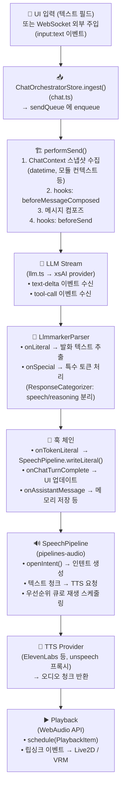
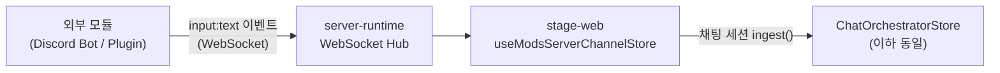
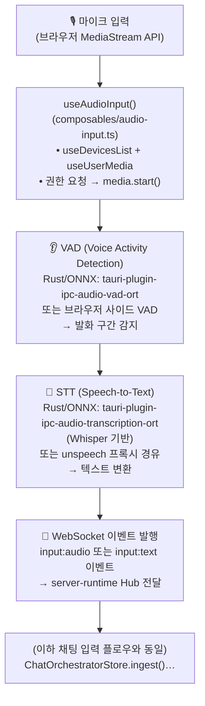
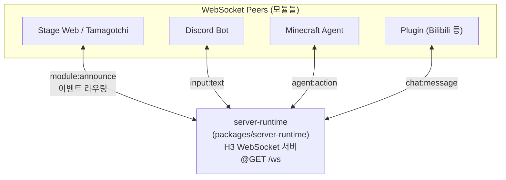
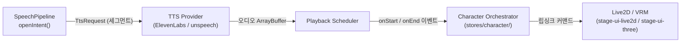

# Airi 입력 플로우 분석 (채팅 / 오디오)

> 작성일: 2026-03-01  
> 기준 버전: 현재 로컬 클론 (`D:\codingagent\EchoCaseAiri\airi`)

---

## 1. 아키텍처 개요

Airi는 **모듈 기반 WebSocket 이벤트 버스** 구조를 핵심으로 한다.
모든 입력(채팅/오디오)은 `server-runtime`의 WebSocket 서버를 허브로 삼아
각 모듈(LLM, TTS, 캐릭터 오케스트레이터 등)이 `module:announce` → 이벤트 구독/발행 방식으로 연결된다.

```
[입력 소스]  →  [stage-web / stage-tamagotchi]  →  [WebSocket Hub]
                                                         ↓
                             [LLM Module] [TTS Module] [Character Module] ...
```

---

## 2. 채팅 입력 플로우

### 2-1. 전체 흐름



### 2-2. 핵심 파일 매핑

| 단계 | 파일 | 역할 |
|------|------|------|
| 입력 진입 | `packages/stage-ui/src/stores/chat.ts` | `ChatOrchestratorStore.ingest()` — 큐 진입점 |
| 큐 처리 | `packages/stream-kit/` | `createQueue()` — 직렬 처리 보장 |
| 컨텍스트 수집 | `stores/chat/context-store.ts` | 모듈 컨텍스트 스냅샷 조합 |
| 훅 체인 | `stores/chat/hooks.ts` | before/after send, token literal 등 |
| Marker 파싱 | `composables/llm-marker-parser.ts` | LLM 응답에서 발화/특수토큰 분리 |
| 발화→TTS | `packages/pipelines-audio/src/speech-pipeline.ts` | `openIntent()` + 세그먼터 + TTS 요청 |
| TTS 세그먼트 | `packages/pipelines-audio/src/processors/tts-chunker.ts` | 토큰 스트림 → 문장 단위 청크 |

### 2-3. WebSocket 외부 주입 (Discord 봇 / 플러그인)



---

## 3. 오디오(마이크) 입력 플로우

### 3-1. 전체 흐름



### 3-2. 플랫폼별 STT/VAD 경로

| 환경 | VAD | STT | 비고 |
|------|-----|-----|------|
| **브라우저** (stage-web) | JS 기반 VAD (Web Worker) | `audio-pipelines-transcribe` + unspeech | WebGPU 추론 WIP |
| **데스크탑** (stage-tamagotchi) | `tauri-plugin-ipc-audio-vad-ort` (Rust/ONNX) | `tauri-plugin-ipc-audio-transcription-ort` (Rust/ONNX, Whisper) | NVIDIA CUDA / Apple Metal 가속 |
| **Discord 봇** | Discord Voice API | Discord STT 또는 외부 API | `services/discord-bot/` |

### 3-3. 핵심 파일 매핑

| 단계 | 파일 | 역할 |
|------|------|------|
| 마이크 획득 | `apps/stage-web/src/composables/audio-input.ts` | MediaStream 관리 |
| 녹음 버퍼 | `apps/stage-web/src/composables/audio-record.ts` | 녹음 및 청크화 |
| VAD (네이티브) | `crates/tauri-plugin-ipc-audio-vad-ort/` | Rust ONNX VAD |
| STT (네이티브) | `crates/tauri-plugin-ipc-audio-transcription-ort/` | Rust Whisper 추론 |
| STT 유틸 | `packages/audio-pipelines-transcribe/src/utils/` | 브라우저측 전처리 유틸 |

---

## 4. 이벤트 버스 (server-runtime) 구조



- **라우팅 방식**: `event.route.destinations` 필드로 특정 모듈(name+index)에 직접 전달 또는 broadcast
- **인증**: 선택적 토큰 인증 (`module:authenticate`)
- **heartbeat**: 60초 TTL, Ping/Pong 관리

---

## 5. TTS 출력 → 립싱크 연결



- `SpeechPipeline`은 **인텐트(Intent)** 단위로 발화를 관리
  - `behavior: 'queue'` — 기존 발화 뒤에 줄 세움
  - `behavior: 'interrupt'` — 우선순위가 높으면 현재 발화 취소
  - `behavior: 'replace'` — 무조건 현재 발화 대체

---

## 6. 정리 — 입력별 핵심 경로 요약

| 입력 | 진입점 | 핵심 처리 | 출력 |
|------|--------|-----------|------|
| **텍스트 채팅 (UI)** | `chat.ts ingest()` | 큐 → LLM 스트림 → 파서 → 훅 | SpeechPipeline → TTS → 립싱크 |
| **텍스트 주입 (WebSocket)** | `server-runtime:input:text` | ModsServerChannelStore → ingest() | 동일 |
| **마이크 (브라우저)** | `audio-input.ts` | VAD → STT → WebSocket 이벤트 | ingest()로 합류 |
| **마이크 (데스크탑)** | Tauri ONNX 플러그인 | Rust VAD → Whisper STT → IPC | ingest()로 합류 |
| **Discord 음성** | `services/discord-bot/` | Discord Voice API → STT | WebSocket → ingest() |
